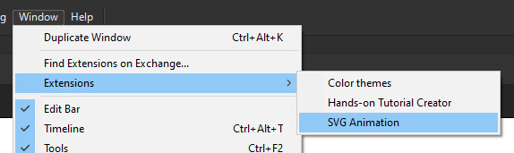

# Animated SVG Exporter for Flash Pro / Adobe Animate#

### INFO: The last version that works in CS5.5 and CS6 is v3.36 ###
### INFO: Mac Users, Animate v2017.1 contains a bug which breaks the plugin, please upgrade to v2017.2 ###

## To Install from Adobe Add-ons ##
- Go to the plugin page at [Adobe Addons](https://creative.adobe.com/addons/products/7232)
- Click the 'Free' button to install

## To Install from ZXP ##
- Select latest release from [releases page](https://github.com/TomByrne/Flash2Svg/releases)
- Install with one of the following tools:
  - [Anastasiy’s Extension Manager](https://install.anastasiy.com/) (recommended)
  - [ZXPInstaller](http://zxpinstaller.com/)
  - Extension Manager (installed with Adobe applications)
  - [ExManCmd](https://www.adobeexchange.com/resources/28)

## To Use in Adobe Animate / Flash Pro CC ##

- Open panel through menus, Window > Extensions > SVG Animation
- Open the FLA you wish to use and navigate to the timeline you wish to export
- Select suitable options
- Click export button

## To Use in Flash Pro CS5 / CS5.5 / CS6 ##
- Open panel through menus, Window > Other Panels > SVG
- Open the FLA you wish to use and navigate to the timeline you wish to export
- Select suitable options
- Click export button

### Installation issues ###
If you've installed the plugin but it isn't showing up, it could be a number of issues related to the Adobe plugin installation system.
[Check here for manual installation process.](docs/manual-install.md)

## To build the extension on Windows ##
- Download the [CS6 Signing Toolkit](http://www.adobe.com/devnet/creativesuite/sdk/eula_cs6-signing-toolkit.html)
- Download the [CC Signing toolkit](http://labs.adobe.com/downloads/extensionbuilder3.html)
- Put the contents of both archives into the `build/tools` folder
- Create a p12 certificate and save it to `build/cert.p12`
- Open the `password.txt` file and save the certificate's password in the file (this will be ignored by GIT).
- Run the `build/build.bat` file

To build on other operating systems, the build.bat file will have to be converted, if you do this send me a pull request and I'll add your script into the main repo.

## Supported features ##
### Core ###
- Symbols
- Bitmaps
- Vector Paths (inc. gradient fills)
- Bitmap fills
- Bitmaps (embedded or as sidecar files)
- Sounds (embedded or as sidecar files, relies on JS in SVG)
- Static Text (as paths)
- Dynamic/Input Text (as HTML foreign objects)

### Animation ###
- Classic motion tweens
- Shape Tweens (get converted to keyframes)
- Motion Guides (get converted to keyframes)
- Auto-rotation tweens (CW & CCW)
- Color/Tint/Alpha tweens

### Filters ###
- Glow
- Blur
- Adjust Color

### Blend Modes ###
- Multiply
- Screen
- Overlay
- Lighten
- Darken
- Difference
- Hard Light
- Invert

## Unsupported features ##
### Core ###
- Button symbols with mouseenter and mouseleave

### Animation ###
- Newer style, per-property tweens
- Tweens on filter properties

### Filters ###
- Drop Shadow
- Bevel
- Gradient Glow
- Gradient Bevel 

### Blend Modes ###
- Layer
- Erase
- Add
- Subtract
- Alpha

## Added features ##
Some features are not in flash but are added to improve the output, they're all optional.

### High FPS ###
This allows tween animations to play at whatever framerate the browser chooses (normally 60 fps). It makes animations look much smoother than their SWF counterpart.

### Animated View Box ###
If you have a scene which you'd like to pan and zoom around during the animation, you can add a rectangular symbol and name it "viewBox" (with exactly that capitalisation) and animate it around your scene. When the animation is exported, this area will be considered the 'camera' and will animate the visible area of the scene during playback.
